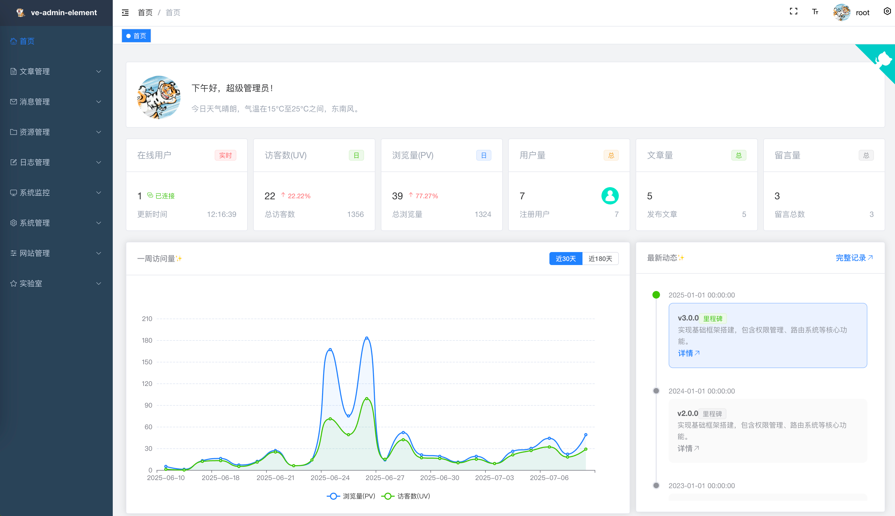
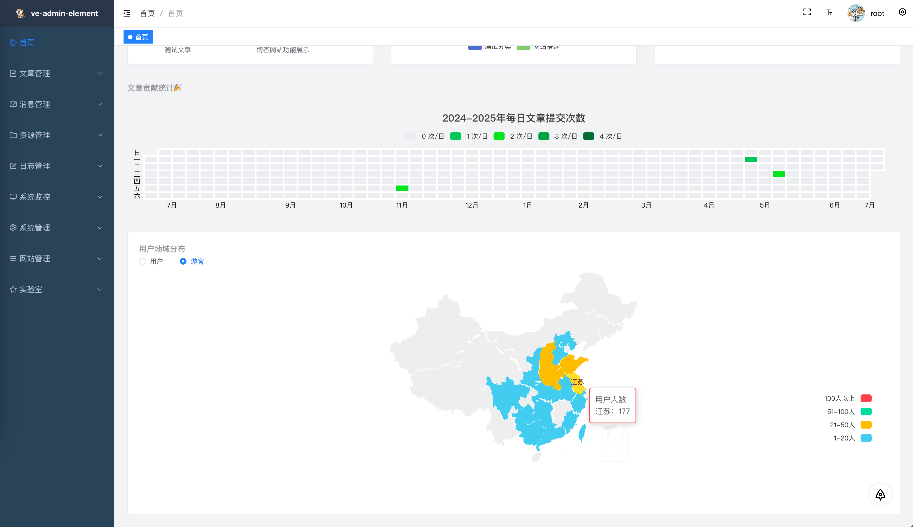
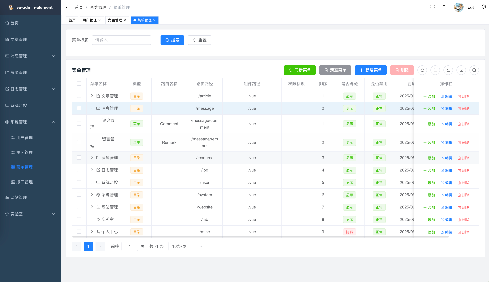

<div align=center>
  

  <h1>ve-admin-element</h1>

  
  
  
  
  
  
</div>

<div align="center">
  <a target="_blank" href="https://admin.veweiyi.cn">🖥️ 在线预览</a> |
  <a target="_blank" href="https://admin.veweiyi.cn/admin-api/v1/swagger/index.html">📑 接口文档</a>
</div>

## 📚 项目简介

ve-admin-element 是一个现代化的博客后台管理系统，基于 Vue 3.5 + TypeScript + Element Plus 构建。项目采用最新的前端技术栈，提供了丰富的功能组件和优雅的用户界面。

## ✨ 项目预览







## ✨ 核心特性

- 🚀 **先进的技术栈**：
  - 使用 Vue 3.5 + TypeScript + Vite 6.2 构建
  - 基于 Element Plus 2.9.6 组件库
  - 采用 Pinia 3.0 状态管理
  - UnoCSS 原子化 CSS 解决方案

- 🎨 **优秀的开发体验**：
  - TypeScript 支持
  - Vue 组合式 API
  - 完整的类型定义
  - 代码规范化配置（ESLint + Prettier）
  - Git 提交规范化（Husky + Commitlint）

- 📦 **丰富的功能组件**：
  - WangEditor 富文本编辑器
  - Markdown 编辑器（md-editor-v3）
  - ECharts 图表支持
  - 文件上传/图片裁剪
  - Excel 导入导出

- 🔐 **完善的权限系统**：
  - 基于角色的访问控制
  - 动态路由权限
  - 细粒度的按钮权限

## 🛠️ 技术栈

- 核心框架：Vue 3.5.13
- UI 组件：Element Plus 2.9.6
- 构建工具：Vite 6.2.6
- 编程语言：TypeScript 5.8.2
- 状态管理：Pinia 3.0.1
- CSS 解决方案：UnoCSS 65.4.3
- HTTP 工具：Axios 1.8.2
- 工具库：lodash-es、dayjs
- 编辑器：@wangeditor/editor、md-editor-v3
- 图表：ECharts 5.6.0

## 📁 项目源码

| 项目               | 功能     | Github                                                               |                                                                     |
|------------------|--------|----------------------------------------------------------------------|---------------------------------------------------------------------|
| ve-blog-golang   | 博客后端服务 | [ve-blog-golang](https://github.com/ve-weiyi/ve-blog-golang.git)     | [ve-blog-golang](https://gitee.com/ve-weiyi/ve-blog-golang.git)     |
| ve-blog-naive    | 博客前台展示 | [ve-blog-naive](https://github.com/ve-weiyi/ve-blog-naive.git)       | [ve-blog-naive](https://gitee.com/ve-weiyi/ve-blog-naive.git)       |
| ve-admin-element | 博客后台管理 | [ve-admin-element](https://github.com/ve-weiyi/ve-admin-element.git) | [ve-admin-element](https://gitee.com/ve-weiyi/ve-admin-element.git) |

## 🏗️ 项目结构

```
ve-admin-element
├── .github/           # GitHub 工作流配置
├── public/            # 静态资源
├── src/               # 源代码
│   ├── api/           # API 接口
│   ├── assets/        # 静态资源
│   ├── components/    # 公共组件
│   ├── directives/    # 自定义指令
│   ├── hooks/         # 组合式函数
│   ├── layout/        # 布局组件
│   ├── router/        # 路由配置
│   ├── store/         # Pinia 状态管理
│   ├── styles/        # 全局样式
│   ├── types/         # TypeScript 类型
│   ├── utils/         # 工具函数
│   └── views/         # 页面组件
├── public/            # 静态资源
├── mock/              # 接口模拟
├── .github/           # GitHub 配置
├── .husky/            # Git Hooks
├── vite.config.ts     # Vite 配置
├── tsconfig.json      # TypeScript 配置
├── uno.config.ts      # UnoCSS 配置
└── package.json       # 项目依赖
```

## 🚀 快速开始

### 环境要求

- Node.js >= 20
- pnpm >= 9

### 开发环境

```bash
# 克隆项目
git clone https://github.com/ve-weiyi/ve-admin-element.git

# 进入项目目录
cd ve-admin-element

# 安装依赖
pnpm install

# 启动开发服务器
pnpm dev
```

### 生产环境

```bash
# 构建生产版本
pnpm build
```

### Docker 部署

```bash
docker run -d \
--name ve-admin-element \
--restart always \
-p 9421:80 \
ghcr.io/ve-weiyi/ve-admin-element:latest
```

## 📋 开发计划

### ✅ 已完成功能

- [x] API接口文件重构
- [x] 登录页面修改
- [x] 博客管理页面移植

### 🚧 开发中功能

- [ ] 支持第三方登录
- [ ] 支持多语言
- [ ] 修改首页布局

## 📄 开源协议

本项目采用 MIT 协议开源，详情请查看 [LICENSE](LICENSE) 文件。
